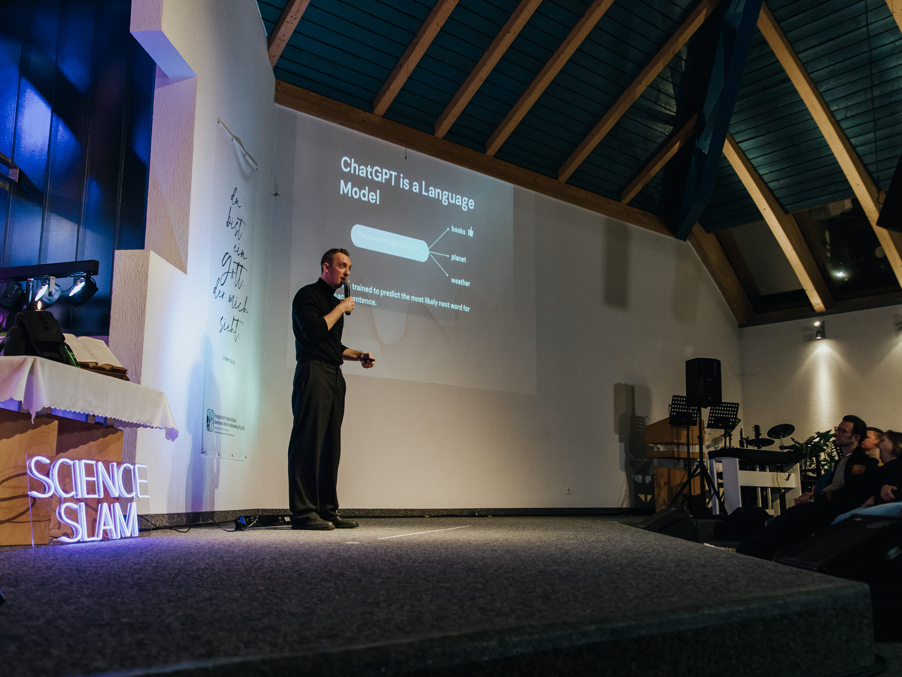
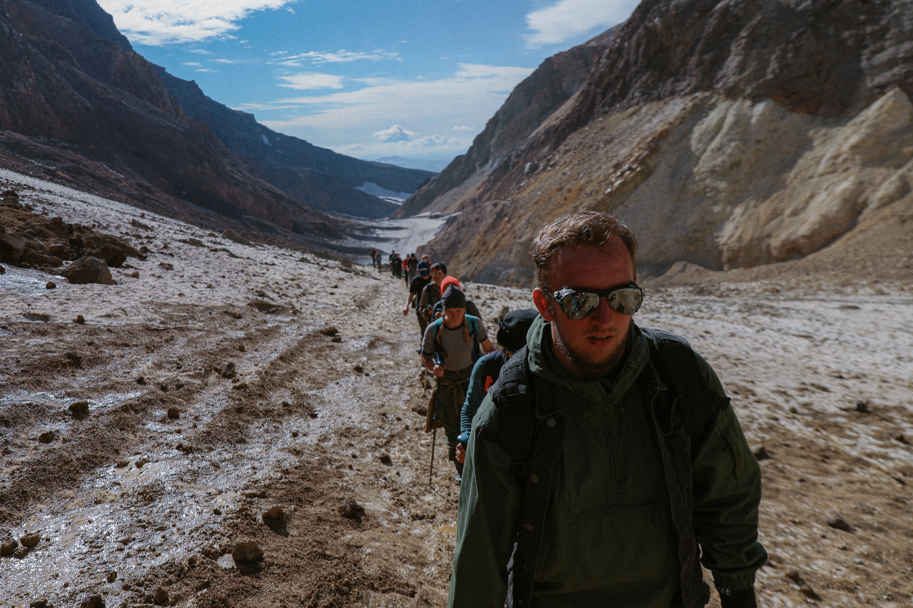
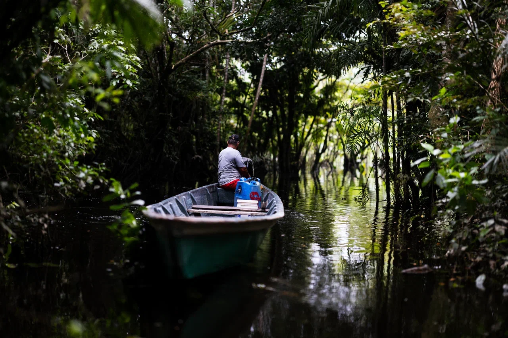
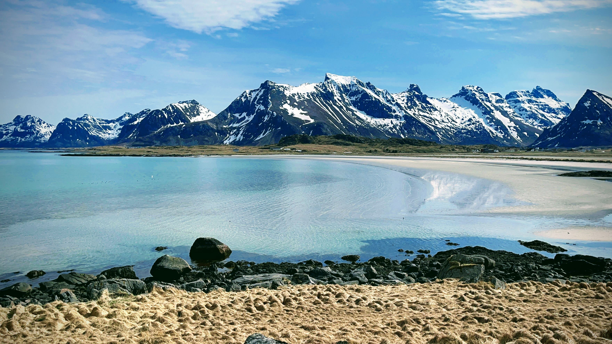

# Intro

Hi, it`s Ilya. I live in Berlin, Germany. I am an AI research engineer with over 8 YOE in industry. Besides I love engaging in the community activities whether it is public speaking, teaching or just meeting new people. In this blog I am sharing technical notes on AI engineering and research as well as insights from community activities I participate in. Below you can find some facts about my work and hobbies. 

## Career 

I am focused on developing production-ready ML/AI applicatons. Currently I work at Wayfair where I am busy with building GenAI solutions for a number of our projects. I love reproducible R&D, high-quality engineering and math. Throughout my career I was lucky to work on impactful projects that required both engineering and research efforts. 

## Community

 In 2023 I co-founded [Street Smart AI](https://www.meetup.com/street-smart-ai-berlin-meetup/) - a series of in-person meetups for industry ML practitioners in Berlin. I also love teaching. One of my favourite educational projects is the [LLM summer school](https://www.llmsforsocialsciene.dev/) at the University of Oxford where I led the practical part of the workshop. You can read more about my public activities in the "talks" section of the website.

## Science and travel

In my free time I love joining expeditions to far away destinations. Sometimes I travel with scientists for specific research missions or join teams of enthusiasts to explore particular cultural aspects of interesting places. 

I was on top of volcanoes on the Kamchatka Peninsula which is a Russian far east region. I survived a week in Amazon jungles of Ecuador and was travelling together with a scientific group to study glaciers of the Elbrus mountain.

 

## Acting and improv

Last but not least from time to time I take part in acting / improv classes, workshops, camps. The initial goal was to improve my public speaking skills for conference talks but later I discovered I enjoy it as independent activity. For example, in April 2024 I attended an art camp in Norway, Lofoten islands. The combination of spectacular nature, open minded people and creative activities made this trip truly legendary! One day I went to a fishing village to speak with locals where I recorded a short documentary film. You can watch it [here](https://youtu.be/KXiPtvKhK3E).

## Collaboration

I enjoy meeting new people and taking part in interesting projects. You can invite me to speak on your event or to ask for consultation regarding your research or company project. Sometimes I help people to prepare for coding and ML system design interviews. Besides, I enjoy knowledge exchange: if you are also an applied ML practitioner, I am happy to meet for a coffee chat and to speak about success and fails in our field!
