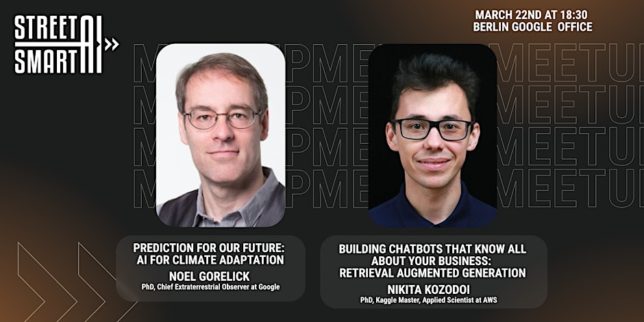
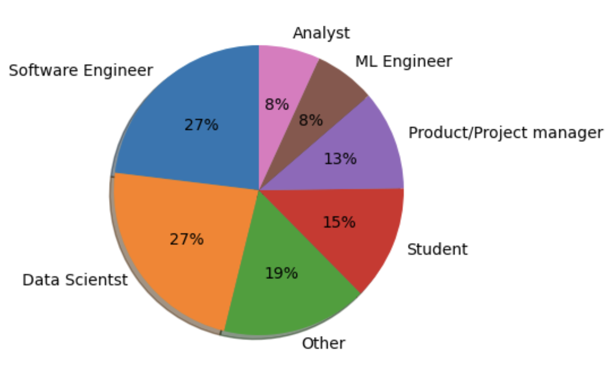
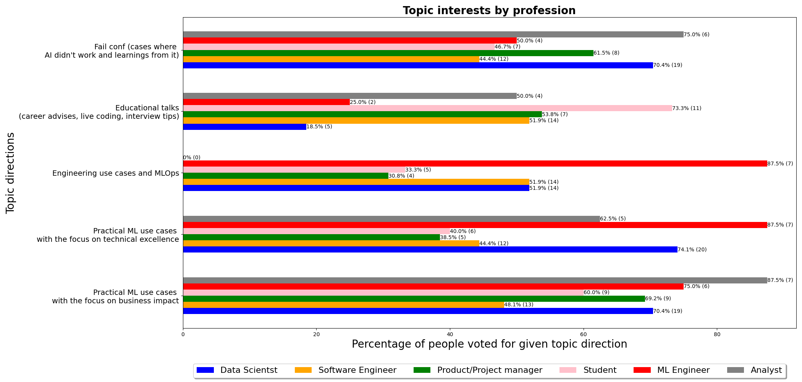
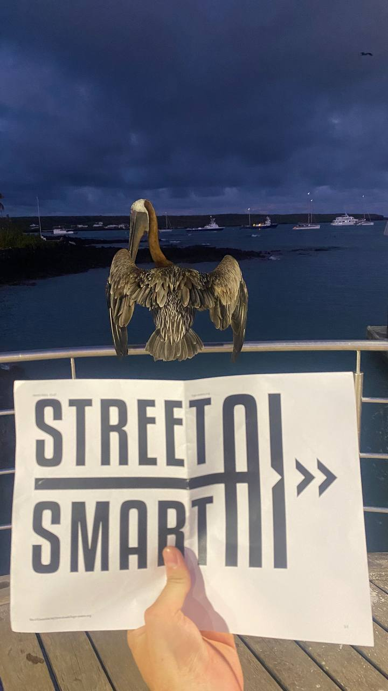

## Intro

In the beginning of 2023 together with my friend [Evgeny](https://www.linkedin.com/in/evgeny-labzin/) we were brainstorming an idea to organize an in-person AI meetup in Berlin targeted for applied scientists. Being industry practitioners ourselves we know that mastering production-ready AI involves more than just book knowledge. One more thing we had in common: both of us enjoy engaging in community activities whether it is teaching, public speaking or just bringing people together.

Motivated by this we developed a concept: to create a space where people can learn from industry experts, network and have fun. This is how Street Smart AI was born! The naming comes from the slang “street smart” that means having a practical knowledge about difficult and dynamic environments.

By design a meetup features 2 talks, each lasting approximately 20 minutes, followed by an interactive Q&A session. We believe this format strikes a balance, allowing for concise yet impactful presentations while ensuring ample time for audience interaction.
Our key values:
* **High quality of talks**: we carefully select speakers and make sure talks are concise and practical.
* **Attention to public speaking**: we believe a combination of great content and great presentation is key to success. We want our speakers to rock the stage and help to prepare the talk.
* **Atmosphere**: our priority is to сreate a welcoming, safe and inclusive environment where people can learn and have fun!

## A debut

Once we developed a vision we started to think about our first event. A friend of ours agreed to be a speaker, I was the second speaker and Evgeny was a moderator. Next step was to find somebody who could host us. We were lucky to speak with Wooga, a game dev company in Berlin. After we had an initial discussion, Wooga decided to go on with us and we started preparation.

The event attracted 80 people, lots of engagement and fun.

 

Everything went great. Except one thing: we promised a pizza during the break but a delivery guy got into the car accident. He was fine, but pizza was not :) In the meantime break already started. The most tense moment was to announce that there won’t be pizza. We were very nervous and decided to explain everything as it was. The audience was very nice, they understood the situation and thanked us anyway. And now Imagine a situation: office kitchen, lots of beer and instead of pizza people eating vegetables that were left on the table! :)

Looking back today we agree on the importance of the first event on our decision to move forward: we got so much support from Wooga and we liked the vibe created by our audience. This was the moment we decided Street Smart AI should be a series!

## Community Growth

After the initial meetup several people reached out and told us they would like to be a speaker too. Also, there were a number of company representatives who wanted to host us. We were happy to discover there was a demand from both sides. Since our first event in March 2023, we've hosted a series of six in-person gatherings at five different venues across Berlin. With each event attracting over 100 attendees, our community has grown steadily. Featuring a diverse lineup of speakers from companies such as Google, Amazon AWS, Zalando, Wayfair and others, we've curated a range of talks spanning various facets of AI application. All presentations, including slides and videos, are available [here](https://drive.google.com/drive/folders/1HvbNthmyYC1G278qe2DDZwwrVaDvXrRa?usp=sharing). Our most recent event was held at the Google Berlin office.

There is a lot to tell about what happens behind the scenes. Below we want to share our organizing experience, specifically:
* how we work with speakers
* insights from the attendees’ feedback analytics
* future plans and a call for action!

## Working with speakers

From our perspective, a successful talk is a combination of great content and public speaking skills. We believe every person can succeed given enough preparation, no talent for public speaking is required. We usually offer our help to brainstorm and refine the structure of the talk, ensuring that it aligns seamlessly with the objectives of our event and resonates with our audience.

Speaker selection process begins with an initial conversation to discuss the topic a potential speaker intends to deliver. If there is alignment between the proposed topic and our event's focus, we proceed to agree on timelines and initiate the preparation process.

We have provided a comprehensive [speaker guide](https://docs.google.com/document/d/1Zb5AJGlVdh0F0pCknqYQMQc6oSBiPQihg6I3zMte55U/edit?usp=sharing) and [application form](https://forms.gle/UthNMTH7WJTGM5Lt8) to assist interested individuals in understanding our expectations and requirements. We encourage potential speakers to familiarize themselves with the guide before submitting an application form.

## Our audience

When designing a program for the event, we are trying to think what topics may be interesting for our audience. In order to understand our audience better, we made a feedback form and asked people to tell us about themselves and their professional interests.

Our audience comprises people of different professional backgrounds, as you can see from the graph below:

The “Others” category includes titles like applied linguist, CEO, investor and cloud specialist. It is great to have a community of people with such diverse professional backgrounds. We are also happy to have a significant number of students!

## Topics focus

In order to understand what topic directions we should prioritize in future, we asked our audience to select up to 3 directions that match their professional interests from the following list:
* Practical ML use cases with the focus on business impact
* Practical ML use cases with the focus on technical excellence
* Engineering use cases and MLOps
* Educational talks (career advice, live coding, interview tips)
* Fail conf (cases where AI didn't work and learnings from it)

According to aggregated results, ML and software engineers are less interested in the “fail conf” format (50% and 44% respectively) in comparison with data scientists and analysts (75% and 70% respectively). 71% of students are interested in formats related to career and interview tips. Overall the most popular category is about ML applications with the focus on business impact. A number of people suggested their own topics related e.g. to AI in startups or AI for social good. We are planning to use these results to design future events.

## Conclusions
We enjoy building the Street Smart AI community in Berlin. The city vibe and the feedback from local people makes it so easy - it just flows. Thanks to all speakers, hosts, attendees and volunteers for being a part of it! Follow our [meetup page](https://www.meetup.com/street-smart-ai-berlin-meetup) to stay up to date with next events.

## Call for action

We keep exploring what we can improve as well as thinking about new formats. Please feel free to reach out to us if you have any ideas about potential collaborations. Some ideas we have in mind:
* **Collaboration with universities**: we value the educational component of meetups and would be happy to partner with universities to organize an event for students.
* **Expand Across Europe (and beyond!)**: we will keep making meetups in Berlin, we are also open to organize a meetup in any city in Europe (UK and US can be an option as well). If you or your company would like to host us, we are happy to discuss!
* **Get to know each other**: we're always open to exploring new collaboration formats and meeting like-minded individuals. If you have any ideas or simply want to connect with us, don't hesitate to reach out. You can directly message and schedule a coffee chat with either [me](https://www.linkedin.com/in/ieboytsov/) or [Evgeny](https://www.linkedin.com/in/evgeny-labzin/). We are excited to hear from you!

## Acknowledgements
I want to thank Evgeny Labzin and Maksim Zubok for comprehensive review and refinement of this post.

